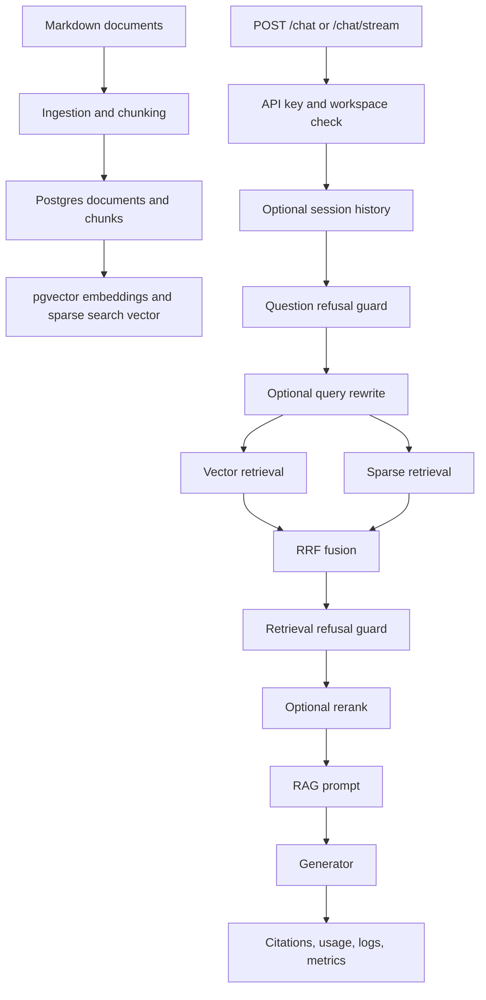

# Production RAG Assistant

[](https://github.com/ictup/production-rag-assistant/actions/workflows/ci.yml)
[](https://github.com/ictup/production-rag-assistant/releases/tag/v0.1.0)
[](pyproject.toml)
[](backend/app/main.py)
[](docker-compose.prod.yml)
[](backend/tests)

Production RAG Assistant is a production-style Retrieval-Augmented Generation
backend built with FastAPI, Postgres/pgvector, hybrid retrieval, provider
switching, deterministic evals, observability, and a minimal browser UI.

The project is designed to run locally without paid model calls by default.
Fake providers are enabled out of the box. OpenAI-compatible embedding,
generation, query rewrite, and reranking can be enabled through `.env` when a
real provider key is available.

## Why This Project Matters

This is not a notebook demo. It is a portfolio-grade AI backend project focused
on the engineering work needed around a RAG system: database modeling, retrieval
quality, workspace isolation, API security, async jobs, eval gates,
observability, deployment checks, and release management.

The goal is to demonstrate that the RAG pipeline can be operated, tested,
audited, and evolved as a backend service rather than only run once in an
experiment.

## Project Highlights

| Area | What is implemented |
| --- | --- |
| RAG pipeline | Markdown ingestion, chunking, fake/OpenAI embeddings, vector retrieval, sparse retrieval, RRF fusion, query rewrite, reranking, citations, and refusal guards |
| API product surface | FastAPI chat, streaming chat, documents, workspaces, sessions, export jobs, health, metrics, and a minimal browser UI |
| Data layer | Postgres, pgvector, Alembic migrations, repositories, workspace foreign keys, audit logs, export job state transitions, and agent approval persistence |
| Security and tenancy | API keys, roles, workspace access control, workspace archive write protection, request IDs, and secret-safe config checks |
| Operations | Dockerfile, production-style Compose stack, export worker, config preflight, deployment runbook, secret manager mapping, and release checklist |
| Quality system | Deterministic evals, smoke tests, CI, README/docs tests, release notes, and a reproducible validation checklist |
| Observability | Structured logs, Prometheus metrics, Agent workflow metrics, provider latency, token usage, cost estimates, and database observability templates |

## Release Status

`v0.1.0` is the production readiness baseline. It includes the complete local
RAG backend, Dockerized production-style runtime, operational documentation, and
validated release gates.

- Release notes: [docs/releases/v0.1.0.md](docs/releases/v0.1.0.md)
- GitHub Release body draft:
  [docs/releases/v0.1.0-github-release.md](docs/releases/v0.1.0-github-release.md)
- Portfolio presentation guide:
  [docs/PORTFOLIO_PRESENTATION.md](docs/PORTFOLIO_PRESENTATION.md)

## What Is Included

- Agentic RAG support workflow foundation with support ticket schemas,
  rule-based classification, risk checks, MCP-style tool specs, a
  `rag_search_tool` backed by the existing RAG retriever, SQL-backed
  `ticket_lookup_tool`, deterministic cited `draft_response_tool`, node-level
  graph runner records, `agent_approvals` persistence, approval API endpoints,
  and a `/agent/support-triage` API that creates pending approvals for
  high-risk requests and emits Agent-specific Prometheus metrics.
- FastAPI API for chat, streaming chat, documents, workspaces, sessions, export
  jobs, health, and metrics.
- Workspace management API with create, update, list, detail, soft archive,
  bulk archive, restore, bulk restore operations, and operation audit logging.
- Postgres + pgvector schema with Alembic migrations, including export job and
  agent approval foundations.
- Markdown ingestion, chunking, content hashing, fake embeddings, OpenAI
  embeddings, and reindexing.
- Hybrid retrieval with vector search, sparse search, metadata filters, RRF
  fusion, optional query rewrite, optional session-history contextualization,
  and optional OpenAI listwise reranking.
- Fake generator and OpenAI Responses API generator, including streaming.
- Refusal guards for unsafe, out-of-scope, low-confidence, and empty-retrieval
  cases.
- Provider timeout, retry, error mapping, structured logs, Prometheus metrics,
  latency metrics, token metrics, and cost estimates.
- Deterministic eval gate with JSONL datasets and trend recording.
- Deterministic Agent support triage eval gate with 30 support cases and JSON
  reports.
- Minimal web UI at `/app/` with sessions, history, SSE chat, document upload,
  reindex actions, workspace creation, editing, archive/restore actions, admin
  overview, workspace search, pagination, status filters, bulk archive/restore
  actions, cross-page matching bulk preview/confirmation, archived-workspace
  read-only guards, chat log audit filters, chat log audit export, chat log
  audit details, workspace operation audit filters, workspace operation audit
  details, and chat error recovery.
- Dockerfile, production-style Compose stack, deployment runbook, and CI
  workflow.

## Architecture



## Repository Map

```text
backend/
  app/
    api/              FastAPI routes and API security
    core/             config, logging, request id, tracing, rate limit
    db/               models, repositories, sessions, Alembic migrations
    observability/    Prometheus metrics registry
    rag/              embeddings, retrieval, reranking, generation, pipeline
    static/           browser UI served by FastAPI
  tests/              unit and integration-style tests

ingestion/            Markdown parsing, cleaning, chunking, hashing, ingest CLI
evals/                eval datasets, runner, reports, trend recorder
data/raw/             seed Markdown documents
monitoring/           Grafana dashboard and Prometheus alert templates
docs/                 handoff, configuration, deployment, observability docs
```

## Quick Start With Docker

Create local configuration:

```powershell
Copy-Item .env.example .env
```

Validate Compose without printing secrets:

```powershell
docker compose -f docker-compose.prod.yml config --quiet
uv run python -m backend.app.core.config_check --production
```

Start the production-style local stack:

```powershell
docker compose -f docker-compose.prod.yml up -d --build
```

Open the UI:

```text
http://127.0.0.1:8000/app/
```

Health check:

```powershell
curl.exe http://127.0.0.1:8000/health
```

If port `8000` is already in use, set `API_PORT` in `.env` before starting the
stack.

## Local Development

Install dependencies and run checks with `uv`:

```powershell
uv sync
uv run ruff check .
uv run pytest
```

Run database migrations:

```powershell
uv run alembic upgrade head
```

Run the API directly on the host:

```powershell
uv run uvicorn backend.app.main:app --host 127.0.0.1 --port 8000
```

Run the default pipeline smoke:

```powershell
uv run python -m backend.app.rag.pipeline_smoke
```

Run the document-management smoke:

```powershell
uv run python -m evals.document_management_smoke
```

Run the eval gate:

```powershell
uv run python -m evals.run --format summary --fail-on-failure --no-output
```

Run the Agent support triage eval gate:

```powershell
uv run python -m evals.agent_run --format summary --fail-on-failure --no-output
```

Current local baseline: `685 passed`.

## Configuration Model

Runtime configuration comes from `.env`. Keep `.env` local-only and use
`.env.example` as the template. The full configuration reference is
[docs/CONFIGURATION.md](docs/CONFIGURATION.md).
Production secret manager mapping is documented in
[docs/SECRET_MANAGER_MAPPING.md](docs/SECRET_MANAGER_MAPPING.md).
Run `uv run python -m backend.app.core.config_check --production` before shared
or real production deployment; it reports only variable names and remediation
guidance, not secret values.

Default local mode:

```text
EMBEDDING_PROVIDER=fake
GENERATOR_PROVIDER=fake
QUERY_REWRITER_PROVIDER=none
RERANKER_PROVIDER=none
API_KEYS=dev-key
API_KEY_ROLES=
```

Enable real OpenAI-compatible providers only when `OPENAI_API_KEY` is set:

```text
EMBEDDING_PROVIDER=openai
GENERATOR_PROVIDER=openai
QUERY_REWRITER_PROVIDER=openai
RERANKER_PROVIDER=openai
OPENAI_API_KEY=<set in local .env or secret manager>
OPENAI_EMBEDDING_MODEL=text-embedding-3-small
LLM_MODEL=gpt-5.4-nano
QUERY_REWRITE_MODEL=gpt-5.4-nano
RERANKER_MODEL=gpt-5.4-nano
```

After changing the embedding provider for an existing database, reindex stored
chunk embeddings so stored vectors and query vectors use the same model:

```powershell
uv run python -m backend.app.rag.reindex_embeddings --workspace-id public --write
```

## Common API Calls

Agent support triage and approvals:

```text
POST /agent/support-triage
GET /agent/approvals
GET /agent/approvals/{approval_id}
POST /agent/approvals/{approval_id}/decision
```

```powershell
curl.exe -X POST http://127.0.0.1:8000/agent/support-triage `
  -H "Authorization: Bearer dev-key" `
  -H "Content-Type: application/json" `
  -d "{\"ticket_id\":\"TICKET-001\",\"customer_message\":\"How can I debug citation validation failures?\",\"workspace_id\":\"public\"}"
```

```powershell
curl.exe "http://127.0.0.1:8000/agent/approvals?workspace_id=public&status=pending" `
  -H "Authorization: Bearer dev-key"

curl.exe -X POST "http://127.0.0.1:8000/agent/approvals/<approval-id>/decision?workspace_id=public" `
  -H "Authorization: Bearer dev-key" `
  -H "Content-Type: application/json" `
  -d "{\"decision\":\"approved\",\"human_feedback\":\"Reviewed and safe to proceed.\"}"
```

Chat:

```powershell
curl.exe -X POST http://127.0.0.1:8000/chat `
  -H "Authorization: Bearer dev-key" `
  -H "Content-Type: application/json" `
  -H "X-Workspace-ID: public" `
  -d "{\"question\":\"What problem does FlashAttention solve?\"}"
```

Streaming chat:

```powershell
curl.exe -N -X POST http://127.0.0.1:8000/chat/stream `
  -H "Authorization: Bearer dev-key" `
  -H "Content-Type: application/json" `
  -H "X-Workspace-ID: public" `
  -d "{\"question\":\"What problem does FlashAttention solve?\"}"
```

Create a chat session:

```powershell
curl.exe -X POST http://127.0.0.1:8000/chat/sessions `
  -H "Authorization: Bearer dev-key" `
  -H "Content-Type: application/json" `
  -H "X-Workspace-ID: public" `
  -d "{\"title\":\"LLM systems\"}"
```

Archive and restore a workspace:

```powershell
curl.exe -X POST http://127.0.0.1:8000/workspaces/tenant-a/archive `
  -H "Authorization: Bearer dev-key" `
  -H "Content-Type: application/json" `
  -d "{\"reason\":\"temporary tenant cleanup\"}"

curl.exe -X POST http://127.0.0.1:8000/workspaces/tenant-a/restore `
  -H "Authorization: Bearer dev-key"
```

Bulk archive and restore workspaces:

```powershell
curl.exe "http://127.0.0.1:8000/workspaces/bulk/preview?status=active&q=tenant&sample_limit=20" `
  -H "Authorization: Bearer dev-key"

curl.exe -X POST http://127.0.0.1:8000/workspaces/bulk/archive-matching `
  -H "Authorization: Bearer dev-key" `
  -H "Content-Type: application/json" `
  -d "{\"q\":\"tenant\",\"status\":\"active\",\"expected_total\":2,\"confirm\":true,\"reason\":\"temporary cleanup\"}"

curl.exe -X POST http://127.0.0.1:8000/workspaces/bulk/archive `
  -H "Authorization: Bearer dev-key" `
  -H "Content-Type: application/json" `
  -d "{\"ids\":[\"tenant-a\",\"tenant-b\"],\"reason\":\"temporary cleanup\"}"

curl.exe -X POST http://127.0.0.1:8000/workspaces/bulk/restore `
  -H "Authorization: Bearer dev-key" `
  -H "Content-Type: application/json" `
  -d "{\"ids\":[\"tenant-a\",\"tenant-b\"]}"
```

Archive and restore operations write `workspace_audit_logs` records with the
request id, hashed API key, action, affected workspace ids, and operation
metadata.

Query workspace operation audit logs:

```powershell
curl.exe "http://127.0.0.1:8000/workspaces/audit-logs?action=archive&workspace_id=tenant-a&limit=20&offset=0" `
  -H "Authorization: Bearer dev-key"
```

The `/app/` Admin overview also exposes these records with action, workspace
ID, request ID, and time-range filters.

Asynchronous export is represented by the `export_jobs` table,
`ExportJobRepository`, `/exports/jobs` API, and export worker. Jobs start as
`pending`, can be claimed by a worker as `running`, and then finish as
`succeeded` or `failed`. Worker output is written under `EXPORT_STORAGE_DIR`.
In production compose, the API and `export-worker` services share the
`export_prod_data` volume so the API can download files written by the worker.
Admin export buttons create a job, poll its status, and download the completed
file through `/exports/jobs/{job_id}/download`. The existing `/chat/logs/export`
route remains synchronous for compatibility. Failed export jobs can be retried
explicitly with `POST /exports/jobs/{job_id}/retry`, which resets the job to
`pending` for the worker to claim again.

Create and inspect an export job:

```powershell
curl.exe -X POST http://127.0.0.1:8000/exports/jobs `
  -H "Authorization: Bearer dev-key" `
  -H "X-Workspace-ID: public" `
  -H "Content-Type: application/json" `
  -d "{\"export_type\":\"chat_logs\",\"format\":\"jsonl\",\"filters\":{\"limit\":1000,\"offset\":0}}"

curl.exe "http://127.0.0.1:8000/exports/jobs?status=pending&export_type=chat_logs" `
  -H "Authorization: Bearer dev-key" `
  -H "X-Workspace-ID: public"
```

Run one worker pass:

```powershell
uv run python -m backend.app.exporting.worker
```

Run a continuously polling worker locally:

```powershell
uv run python -m backend.app.exporting.worker --loop
```

The loop sleeps for `EXPORT_WORKER_POLL_INTERVAL_SECONDS` when there is no
pending job. Production compose starts this loop as the `export-worker` service:

```powershell
docker compose -f docker-compose.prod.yml logs -f export-worker
```

Each worker iteration first resets stale `running` jobs back to `pending` when
their `started_at` age exceeds `EXPORT_JOB_RUNNING_TIMEOUT_SECONDS`. This lets a
new worker process recover jobs left behind by a crashed or interrupted worker.
The worker also deletes expired top-level `.jsonl` and `.csv` files from
`EXPORT_STORAGE_DIR` after `EXPORT_FILE_RETENTION_SECONDS`; job metadata remains
available for audit, and old downloads return `404 export file not found` after
the file is removed.

Download a completed job:

```powershell
curl.exe "http://127.0.0.1:8000/exports/jobs/<job-id>/download" `
  -H "Authorization: Bearer dev-key" `
  -H "X-Workspace-ID: public" `
  -o chat-logs.jsonl
```

Retry a failed export job:

```powershell
curl.exe -X POST "http://127.0.0.1:8000/exports/jobs/<job-id>/retry" `
  -H "Authorization: Bearer dev-key" `
  -H "X-Workspace-ID: public"
```

Archived workspaces remain readable for audit and recovery, but write-oriented
operations return `409 workspace archived`. This includes chat, streaming chat,
chat session creation, document upload, document deletion, and document reindex.
The web UI mirrors this policy by disabling write controls for the current
workspace after it detects `archived_at`.

## Validation Checklist

Run before committing:

```powershell
uv run ruff check .
uv run pytest
uv run python -m backend.app.core.config_check
uv run python -m evals.run --format summary --fail-on-failure --no-output
uv run python -m evals.agent_run --format summary --fail-on-failure --no-output
uv run python -m backend.app.rag.pipeline_smoke
uv run python -m evals.document_management_smoke
docker compose -f docker-compose.prod.yml config --quiet
rg -n "s[k]-" backend docs .github ingestion evals pyproject.toml README.md Makefile docker-compose.yml docker-compose.prod.yml .env.example Dockerfile .dockerignore
```

The secret scan should only match intentional placeholders, never real keys.

## Documentation

- [Project handoff and quick start](docs/PROJECT_HANDOFF.md)
- [Portfolio presentation guide](docs/PORTFOLIO_PRESENTATION.md)
- [Agentic RAG support workflow design](docs/agentic_rag_extension.md)
- [Configuration and secrets guide](docs/CONFIGURATION.md)
- [Secret manager mapping](docs/SECRET_MANAGER_MAPPING.md)
- [Deployment runbook](docs/DEPLOYMENT_RUNBOOK.md)
- [Release checklist](docs/RELEASE_CHECKLIST.md)
- [Release v0.1.0 notes](docs/releases/v0.1.0.md)
- [GitHub Release v0.1.0 body](docs/releases/v0.1.0-github-release.md)
- [Observability guide](docs/OBSERVABILITY.md)
- [Database observability guide](docs/DATABASE_OBSERVABILITY.md)
- [Eval trends guide](docs/EVAL_TRENDS.md)

## Build Image

```powershell
docker build -t production-rag-assistant:local .
```
