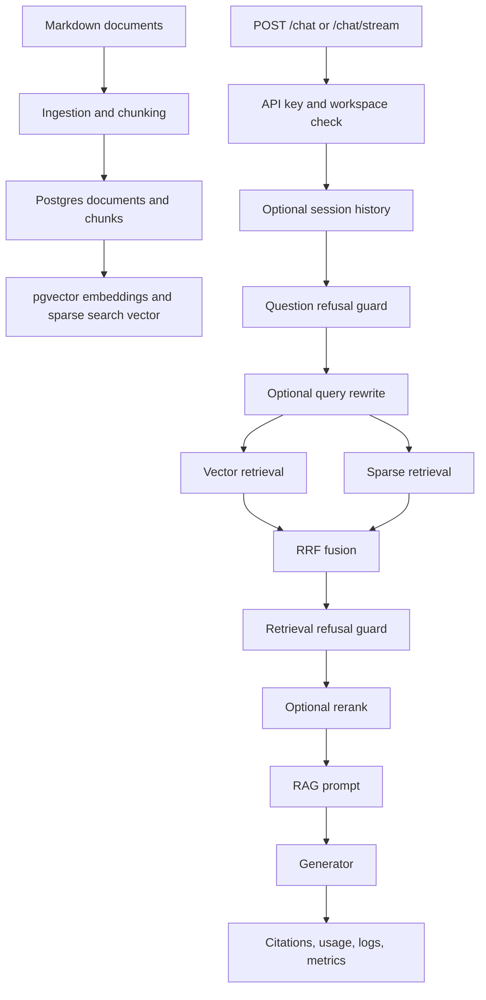

# Production RAG Assistant

Production RAG Assistant is a production-style Retrieval-Augmented Generation
backend built with FastAPI, Postgres/pgvector, hybrid retrieval, provider
switching, deterministic evals, observability, and a minimal browser UI.

The project is designed to run locally without paid model calls by default.
Fake providers are enabled out of the box. OpenAI-compatible embedding,
generation, query rewrite, and reranking can be enabled through `.env` when a
real provider key is available.

## What Is Included

- FastAPI API for chat, streaming chat, documents, workspaces, sessions,
  health, and metrics.
- Postgres + pgvector schema with Alembic migrations.
- Markdown ingestion, chunking, content hashing, fake embeddings, OpenAI
  embeddings, and reindexing.
- Hybrid retrieval with vector search, sparse search, metadata filters, RRF
  fusion, optional query rewrite, optional session-history contextualization,
  and optional OpenAI listwise reranking.
- Fake generator and OpenAI Responses API generator, including streaming.
- Refusal guards for unsafe, out-of-scope, low-confidence, and empty-retrieval
  cases.
- Provider timeout, retry, error mapping, structured logs, Prometheus metrics,
  latency metrics, token metrics, and cost estimates.
- Deterministic eval gate with JSONL datasets and trend recording.
- Minimal web UI at `/app/` with sessions, history, SSE chat, document upload,
  reindex actions, admin overview, audit filters, audit details, and chat error
  recovery.
- Dockerfile, production-style Compose stack, deployment runbook, and CI
  workflow.

## Architecture



## Repository Map

```text
backend/
  app/
    api/              FastAPI routes and API security
    core/             config, logging, request id, tracing, rate limit
    db/               models, repositories, sessions, Alembic migrations
    observability/    Prometheus metrics registry
    rag/              embeddings, retrieval, reranking, generation, pipeline
    static/           browser UI served by FastAPI
  tests/              unit and integration-style tests

ingestion/            Markdown parsing, cleaning, chunking, hashing, ingest CLI
evals/                eval datasets, runner, reports, trend recorder
data/raw/             seed Markdown documents
monitoring/           Grafana dashboard and Prometheus alert templates
docs/                 handoff, configuration, deployment, observability docs
```

## Quick Start With Docker

Create local configuration:

```powershell
Copy-Item .env.example .env
```

Validate Compose without printing secrets:

```powershell
docker compose -f docker-compose.prod.yml config --quiet
```

Start the production-style local stack:

```powershell
docker compose -f docker-compose.prod.yml up -d --build
```

Open the UI:

```text
http://127.0.0.1:8000/app/
```

Health check:

```powershell
curl.exe http://127.0.0.1:8000/health
```

If port `8000` is already in use, set `API_PORT` in `.env` before starting the
stack.

## Local Development

Install dependencies and run checks with `uv`:

```powershell
uv sync
uv run ruff check .
uv run pytest
```

Run database migrations:

```powershell
uv run alembic upgrade head
```

Run the API directly on the host:

```powershell
uv run uvicorn backend.app.main:app --host 127.0.0.1 --port 8000
```

Run the default pipeline smoke:

```powershell
uv run python -m backend.app.rag.pipeline_smoke
```

Run the document-management smoke:

```powershell
uv run python -m evals.document_management_smoke
```

Run the eval gate:

```powershell
uv run python -m evals.run --format summary --fail-on-failure --no-output
```

Current local baseline: `451 passed`.

## Configuration Model

Runtime configuration comes from `.env`. Keep `.env` local-only and use
`.env.example` as the template. The full configuration reference is
[docs/CONFIGURATION.md](docs/CONFIGURATION.md).

Default local mode:

```text
EMBEDDING_PROVIDER=fake
GENERATOR_PROVIDER=fake
QUERY_REWRITER_PROVIDER=none
RERANKER_PROVIDER=none
API_KEYS=dev-key
```

Enable real OpenAI-compatible providers only when `OPENAI_API_KEY` is set:

```text
EMBEDDING_PROVIDER=openai
GENERATOR_PROVIDER=openai
QUERY_REWRITER_PROVIDER=openai
RERANKER_PROVIDER=openai
OPENAI_API_KEY=<set in local .env or secret manager>
OPENAI_EMBEDDING_MODEL=text-embedding-3-small
LLM_MODEL=gpt-5.4-nano
QUERY_REWRITE_MODEL=gpt-5.4-nano
RERANKER_MODEL=gpt-5.4-nano
```

After changing the embedding provider for an existing database, reindex stored
chunk embeddings so stored vectors and query vectors use the same model:

```powershell
uv run python -m backend.app.rag.reindex_embeddings --workspace-id public --write
```

## Common API Calls

Chat:

```powershell
curl.exe -X POST http://127.0.0.1:8000/chat `
  -H "Authorization: Bearer dev-key" `
  -H "Content-Type: application/json" `
  -H "X-Workspace-ID: public" `
  -d "{\"question\":\"What problem does FlashAttention solve?\"}"
```

Streaming chat:

```powershell
curl.exe -N -X POST http://127.0.0.1:8000/chat/stream `
  -H "Authorization: Bearer dev-key" `
  -H "Content-Type: application/json" `
  -H "X-Workspace-ID: public" `
  -d "{\"question\":\"What problem does FlashAttention solve?\"}"
```

Create a chat session:

```powershell
curl.exe -X POST http://127.0.0.1:8000/chat/sessions `
  -H "Authorization: Bearer dev-key" `
  -H "Content-Type: application/json" `
  -H "X-Workspace-ID: public" `
  -d "{\"title\":\"LLM systems\"}"
```

## Validation Checklist

Run before committing:

```powershell
uv run ruff check .
uv run pytest
uv run python -m evals.run --format summary --fail-on-failure --no-output
uv run python -m backend.app.rag.pipeline_smoke
uv run python -m evals.document_management_smoke
docker compose -f docker-compose.prod.yml config --quiet
rg -n "s[k]-" backend docs .github ingestion evals pyproject.toml README.md Makefile docker-compose.yml docker-compose.prod.yml .env.example Dockerfile .dockerignore
```

The secret scan should only match intentional placeholders, never real keys.

## Documentation

- [Project handoff and quick start](docs/PROJECT_HANDOFF.md)
- [Configuration and secrets guide](docs/CONFIGURATION.md)
- [Deployment runbook](docs/DEPLOYMENT_RUNBOOK.md)
- [Observability guide](docs/OBSERVABILITY.md)
- [Database observability guide](docs/DATABASE_OBSERVABILITY.md)
- [Eval trends guide](docs/EVAL_TRENDS.md)

## Build Image

```powershell
docker build -t production-rag-assistant:local .
```
